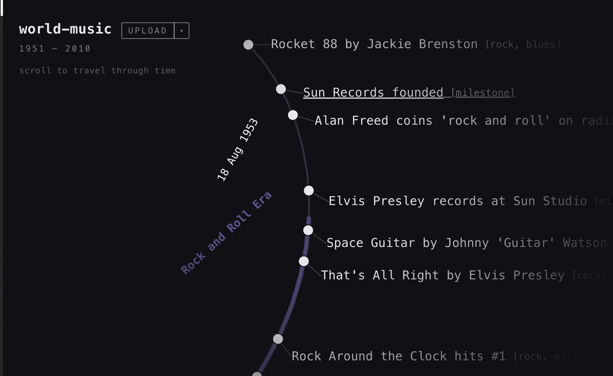

# til

timeline file format and CLI with web viewer and editor



til is a file format and CLI for creating and managing timelines, stored as
files with the `.til` extension. Timelines hold events and ranges, all of which
can be tagged for grouping and organising occurrences.

Events and ranges can also carry an opaque `ref` (e.g. a URL or external ID) and
a freeform `attributes` JSON blob, so `.til` works as a minimal temporal index —
store the index in `.til`, and point `ref` at the payload wherever it lives.

This repo also includes a web app for viewing, editing and creating new
timelines.
You can try it out at [til.rfy.nz](https://til.rfy.nz).

## Install

Clone locally and install the `til` CLI with cargo:

```
cargo install --path .
```

You can also use the [web app](https://til.rfy.nz).

## Local Usage

til is a command line utility. Every invocation takes the path to a `.til` file
as its first argument; the `.til` extension may be omitted.

To create a new timeline, run til with no subcommand:

```
til half-life-3
```

If `half-life-3.til` does not exist, it is created. If it already exists, til
prints a summary (event/range/tag counts).

To add an event:

```
til half-life-3 event add "first person to think about half-life 3" 2004-11-16
```

Dates are accepted in several forms:

- ISO datetime: `2004-11-16T09:30:00`
- ISO date: `2004-11-16` (defaults to midnight)
- Year/month: `2004-11`
- Compact: `20041116`
- Named month: `November 16 2004`, `Nov 2004`
- Bare year: `2004`

Events can carry an opaque `--ref` (any string; URL, UUID, S3 key, etc.) and
an `--attributes` JSON blob:

```
til half-life-3 event add "hl3 announcement" 2024-01-01 \
    --ref "https://example.com/hl3-press-release" \
    --attributes '{"source": "press release", "confidence": "low"}'
```

Ranges accept the same flags.

To add a range, supply `--start` and/or `--end` datetimes:

```
til half-life-3 range add "half-life 3 time to release" --start 2004-11-16
```

The above adds a range that begins, but never ends until the universe
itself dies alongside everything that has ever existed.

A range needs at least one of `--start` or `--end`.

To render the timeline:

```
til half-life-3 show
```

This prints events (sorted by datetime), ranges, and tags.

Other commands:

- `til <file> inspect`: counts of events, ranges and tags.
- `til <file> event {remove,tag,untag,list}`: manage events.
- `til <file> range {remove,tag,untag,list}`: manage ranges.
- `til <file> tag {add,delete,list}`: manage tags.
- `til <file> merge <other.til> [...]`: merge other timelines into this one.

## Web App

The web app lives in `fe/`. The WASM bindings are generated, not committed, so
build them on first run:

```
cd fe
pnpm install
pnpm build:wasm
pnpm dev
```

## .til file

The `.til` file is a binary file that stores data for a single timeline.

The layout is a 4-byte magic `TIL\0` + a 1-byte version (currently `1`) +
a [postcard](https://postcard.jamesmunns.com/)-encoded `Timeline { id, label,
events, ranges, tags }`. Events and ranges share the same shape: `id` (UUID
v7), `datetime` (or `value` for ranges), `tags`, `label`, optional `ref`,
optional `attributes`.

## License

MIT (see [LICENSE](LICENSE)).
